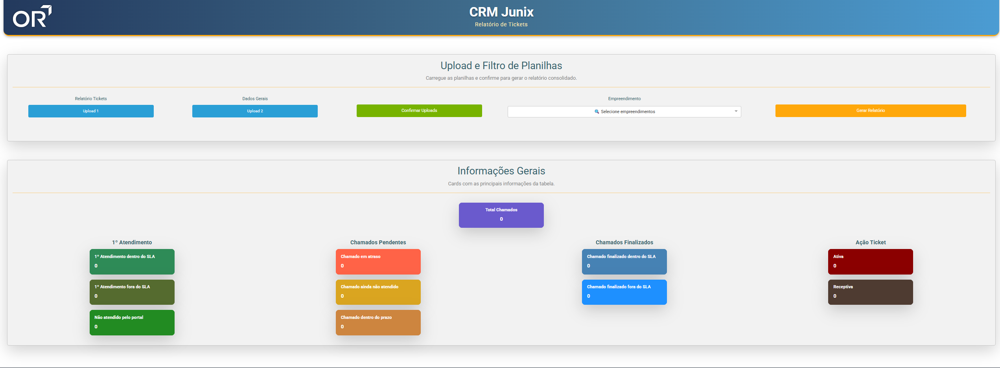
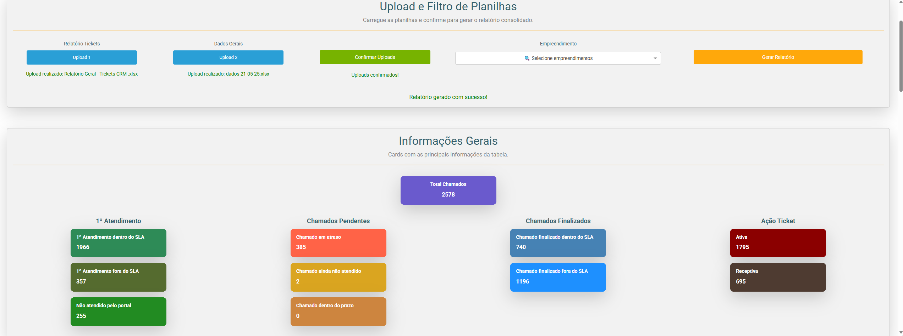
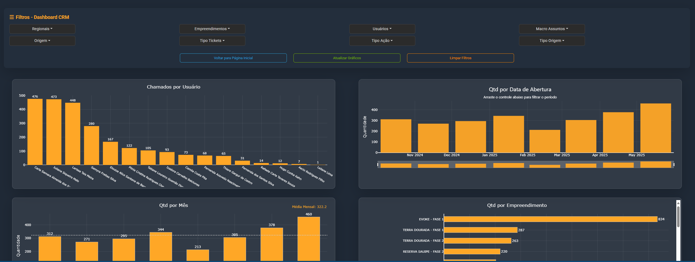

# 📊 Relatório de Sistema de Recebíveis

Esta aplicação web foi desenvolvida em Python com Dash para consolidar, tratar e analisar relatórios exportados do sistema de recebíveis. O foco principal é medir o desempenho da equipe de Relacionamento com o Cliente com base nos SLAs definidos.

## ✨ Funcionalidades

- Upload de 2 planilhas geradas pelo sistema de recebíveis (módulo CRM)
- Possibilidade de filtrar o relatório por Empreendimento
- Consolidação e tratamento automático dos dados
- Classificação dos chamados por tipo de SLA (48h e 72h)
- Visualização de indicadores em cards coloridos
- Dashboard interativo com filtros e gráficos responsivos
- Exportação do relatório consolidado em Excel
- Cálculo inteligente de prazos com feriados nacionais e finais de semana

---

## 🖼️ Demonstrações Visuais

### 📌 Página Inicial e Indicadores


### 📌 Após upload e geração do relatório


### 📈 Dashboard Interativo - Parte 1


### 📈 Dashboard Interativo - Parte 2


---

## ⚙️ Tecnologias Utilizadas

A aplicação foi desenvolvida com:

- **Python**
- **Dash** – Framework para criação de dashboards interativos
- **Dash Bootstrap Components** – Componentes com visual profissional
- **Pandas** – Manipulação e limpeza de dados
- **Plotly** – Criação de gráficos dinâmicos e responsivos
- **XlsxWriter** – Exportação para Excel
- **NumPy** – Suporte ao cálculo de datas úteis
- **datetime** – Cálculos de SLA
- **Feriados personalizados** – Baseados em finais de semana e feriados nacionais do Brasil

---

## 🗂️ Estrutura do Projeto

```text
📦 relatorio_sistema_recebiveis
├── app.py
├── callbacks.py
├── dashboard.py
├── dashboard_callbacks.py
├── feriados.py
├── layout.py
├── requirements.txt
├── custom.css
├── assets/
│   └── images/
│       ├── img_1.png
│       ├── img_2.png
│       ├── img_3.png
│       └── img_4.png
```
---

## 🏁 Como Executar Localmente

1. Clone o repositório:

- git clone https://github.com/paesdj1987/relatorio_sistema_recebiveis.git
- cd relatorio_sistema_recebiveis

2. Crie um ambiente virtual (opcional, mas recomendado):

- python -m venv venv
- venv\Scripts\activate  # Windows
- source venv/bin/activate  # Linux/macOS

3. Instale as dependências:

- pip install -r requirements.txt

4. Execute o aplicativo:

- python app.py

## 👤 Autor
Desenvolvido por João Paes
🔗 github.com/paesdj1987